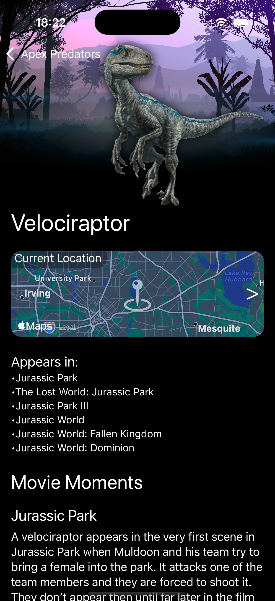

# JP Apex Predators

JP Apex Predators is an iOS app that showcases the apex predators from the Jurassic Park universe. Explore detailed information, locations, and appearances of your favorite dinosaurs and creatures.

## Features

- Dinosaur listing with images and quick info  
- Detailed view for each dinosaur  
- Custom map showing dinosaur locations  
- Use dinosaur stickers in iMessages

## Screenshots

_Add a screenshot for each feature below:_

### Dinosaur Listing

### Dinosaur Filter by Type

### Dinosaur Details

### Custom Map Location

### iMessage Stickers

## Project Structure

- `App/` – App entry point and main configuration  
- `Model/` – Data models (`ApexPredator`, etc.)  
- `Service/` – Data loading and filtering logic  
- `View/` – SwiftUI views and UI components  
- `Resource/` – Assets and JSON data

## License

This project is licensed under the MIT License.
